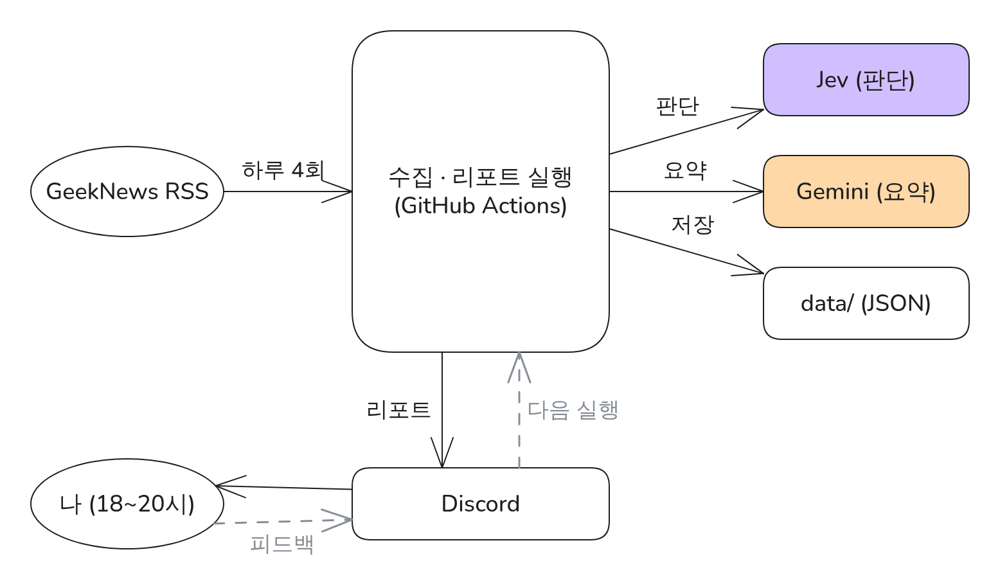

# GeekNews Digest

> 매일 올라오는 기술 뉴스를 내 관심사 기준으로 골라 요약해, 18시 전에 Discord로 보내 주는 개인 리포트 봇



<sub>그림 원본: [Excalidraw](portfolio/figures/FIG-P0-architecture.excalidraw) · 설계 문서의 같은 구조: [ARCH-D1](docs/01-architecture.md#arch-d1-전체-아키텍처) · 포트폴리오 PDF(초안): [geeknews-digest-portfolio.pdf](portfolio/dist/geeknews-digest-portfolio.pdf)</sub>

## 무엇을 하나

- **수집**: GeekNews RSS가 최신 50건만 보여주는 제약 속에서 하루 4번 수집하고 17:30에 마감한다.
- **선별**: 판단 전용 모델 Jev가 기사마다 분야·관심도·실무 활용·제외 여부를 **확률**로 판단한다.
- **요약**: Gemini 무료 API가 Top 최대 8개만 한 번에 요약하고, Jev가 요약이 원문에 근거하는지 다시 검증한다.
- **피드백**: Discord 피드백 채널에 텍스트로 의견을 남기면 다음 날 판단 기준에 반영된다.

## 이 프로젝트에서 나의 역할

| 영역 | 담당 | 결과물 |
|---|---|---|
| 기획 | 나 | 요구사항 14개, 범위 정의 — [00-overview](docs/00-overview.md) |
| 설계 | 나 | 아키텍처, 수집 범위 규칙, 판단 질문·선별 규칙, 데이터 구조, 프롬프트, 리포트 양식, 피드백 구조 — [docs/](docs/README.md), 결정 기록 [ADR 8건](docs/decisions/README.md) |
| 측정 설계 | 나 | 문제 해결 후보별 측정 계획 — [portfolio/](portfolio/README.md) |
| 구현·테스트 | Claude Code | 설계 문서 ID 단위 구현, 규칙 ID가 붙은 테스트 — [작업 규칙](CLAUDE.md) |
| 문서 최신화·기록 | Claude Code | 구현하며 설계 문서·다이어그램 갱신, 문제 해결 로그 — [worklog](docs/worklog.md) |
| 검증·확정 | 나 | PR 검토, 포트폴리오 문장 확정 |

설계 항목마다 ID(예: `JEV-Q2`)가 있고, 코드 주석·테스트 이름·커밋이 같은 ID를 가리켜 **설계 → 구현 추적**이 가능하다.

## 기술

Python 3.12 · uv · pytest · GitHub Actions · OpenRouter (Jev `typesafe/jev-1.13`) · Gemini API · Discord REST · JSON in git

## 진행 상황

| Phase | 작업 | 상태 |
|---|---|---|
| 설계 | 요구사항 · 아키텍처 · 상세 설계 · 결정 기록 · 포트폴리오 틀 | 완료 |
| 0 로컬 준비 | T00 저장소 · 환경 · CLI 뼈대 | 완료 |
| 1 로컬 구현 | T01~T09 | 진행 중 (T01 완료) |
| 2 통합 테스트 | T10 | 대기 |
| 3 자동화·이관 | T11 GitHub Actions, T12 클라우드 세션 | 대기 |
| 4 포트폴리오 | T13 측정, T14 초안·PDF | 대기 |

자세한 작업 목록: [08-implementation-plan](docs/08-implementation-plan.md) · 작업 기록: [worklog](docs/worklog.md) · 로컬 세팅과 Claude Code 시작: [SETUP](docs/SETUP.md)

## 문제 해결 경험 (포트폴리오)

| ID | 가제 | 상태 |
|---|---|---|
| P1 | RSS 50건 제한 속 하루치 수집 누락 방지 | 후보 |
| P2 | Gemini 무료 한도 안에서 요약: Jev 선별 후 1회 호출 | 후보 |
| P3 | LLM 요약의 원문 외 내용을 Jev 근거 검증으로 차단 | 후보 |
| P4 | 텍스트 피드백과 기준선 보정으로 Top 적중률 개선 | 후보 |

각 항목은 제목 → 그림 → 문제 원인 → 해결 과정 → 결과(수치 + 테스트 조건) 구조로 정리한다. 결과 수치는 운영 데이터로 측정한 뒤 채운다. 원고는 [portfolio/problems](portfolio/problems/), PDF 초안은 [portfolio/dist](portfolio/dist/).

## 저장소 구조

```
docs/          설계 문서 (기준) · Mermaid 다이어그램 · ADR · 작업 기록
portfolio/     포트폴리오 원고 · Excalidraw 그림 · 문제 해결 로그 · 측정 증거
src/gndigest/  구현 (T00부터)
tests/         규칙 ID가 붙은 테스트 (인터넷 없이 실행)
experiments/   포트폴리오 측정 스크립트
data/          운영 데이터 (GitHub Actions가 커밋)
tools/         그림 생성기(figgen.py), 그림 내보내기·PDF 빌드(portfolio/)
CLAUDE.md      Claude Code 작업 규칙
```
