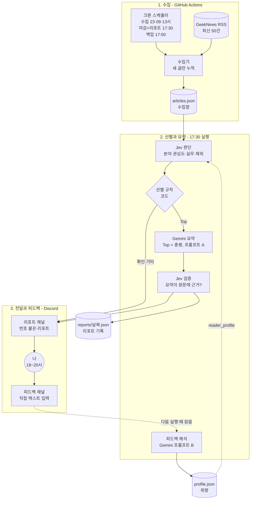

# 01. 전체 아키텍처

> 상태: 확정 · 최종 수정: 2026-09-29 · 관련 코드: `src/gndigest/` · 관련 ADR: [ADR-002](decisions/ADR-002-jev-gemini-roles.md), [ADR-005](decisions/ADR-005-json-in-git.md)

## ARCH-D1 전체 아키텍처



**읽는 법**: 위에서 아래로 하루가 흐른다. 실선은 같은 실행 안의 흐름, 점선은 다음 실행으로 넘어가는 흐름이다. 원통 모양은 `data/` 폴더의 파일이다.

## 1. 컴포넌트

| ID | 컴포넌트 | 하는 일 | 코드 | 상세 |
|---|---|---|---|---|
| ARCH-01 | 스케줄러 | 하루 4회 실행과 17:50 백업 리포트 실행(SCH-R9)을 시작한다 | `.github/workflows/` | [02](02-schedule-and-range.md) |
| ARCH-02 | 수집기 | RSS를 읽어 범위 안의 새 글만 수집함에 추가 | `rss.py`, `window.py` | [02](02-schedule-and-range.md) |
| ARCH-03 | 피드백 리더 | 피드백 채널의 내 새 메시지를 읽는다 | `discord_client.py` | [07](07-feedback-loop.md) |
| ARCH-04 | 피드백 해석기 | Gemini로 메시지를 변경 사항 JSON으로 바꾸고 프로필 갱신 | `feedback.py`, `prefs.py` | [05](05-gemini-prompts.md), [07](07-feedback-loop.md) |
| ARCH-05 | Jev 판단기 | 기사마다 질문 4개를 묻고 확률을 저장 | `jev.py` | [03](03-jev-decisions.md) |
| ARCH-06 | 선별기 | 기준선으로 섹션을 나누고 번호를 매긴다 | `selector.py` | [03](03-jev-decisions.md) |
| ARCH-07 | 요약기 | Top 요약과 총평을 Gemini로 만든다 | `summarizer.py` | [05](05-gemini-prompts.md) |
| ARCH-08 | 검증기 | 요약이 원문에 근거하는지 Jev로 확인 | `verify.py` | [03](03-jev-decisions.md) |
| ARCH-09 | 리포트 전송기 | Discord 임베드를 만들어 두 메시지로 보낸다 | `report.py`, `discord_client.py` | [06](06-discord-report.md) |
| ARCH-10 | 보정기 | 매주 월요일 기준선 변경을 제안 | `tuning.py` | [07](07-feedback-loop.md) |
| ARCH-11 | 저장소 | JSON 읽기·쓰기(원자적 저장), 보관 기간 정리 | `storage.py` | [04](04-data-model.md) |
| ARCH-12 | 지표 기록기 | 실행마다 호출 수·비용·지연·섹션 수를 metrics.jsonl에 한 줄 기록 | `metrics.py` | [04 DATA-06](04-data-model.md#data-06-metricsjsonl--실행-지표) |

## 2. 외부 서비스

| 서비스 | 용도 | 인증 | 비고 |
|---|---|---|---|
| GeekNews RSS `https://news.hada.io/rss/news` | 글 수집 | 없음 | Atom 형식, 최신 50건 |
| OpenRouter Decisions API `POST https://openrouter.ai/api/alpha/decisions` | Jev 호출 | `OPENROUTER_API_KEY` | 모델 `typesafe/jev-1.13` 고정, 입력 토큰만 과금 |
| Google Gemini API (AI Studio 무료 티어) | 요약·피드백 해석 | `GEMINI_API_KEY` | Flash 계열만 무료, 하루 최대 2회 호출 |
| Discord REST API | 리포트 전송, 피드백 읽기 | `DISCORD_BOT_TOKEN` | Message Content Intent 켜기 필요 |
| GitHub Actions | 예약 실행, data 커밋 | 기본 `GITHUB_TOKEN` | cron은 UTC 기준, 지연 가능 |

## 3. 비밀값과 설정 (ARCH-S1)

비밀값은 로컬에서는 `.env`(git 제외), 운영에서는 GitHub Secrets에만 둔다. `data/`와 코드에는 절대 넣지 않는다.

| 이름 | 종류 | 설명 |
|---|---|---|
| `OPENROUTER_API_KEY` | 비밀 | Jev 호출 |
| `GEMINI_API_KEY` | 비밀 | Gemini 호출 |
| `DISCORD_BOT_TOKEN` | 비밀 | 봇 토큰 |
| `DISCORD_REPORT_CHANNEL_ID` | 설정 | 리포트 채널 |
| `DISCORD_FEEDBACK_CHANNEL_ID` | 설정 | 피드백 채널 |
| `DISCORD_OWNER_USER_ID` | 설정 | 이 계정의 메시지만 피드백으로 인정 |
| `GEMINI_MODEL` | 설정 | 무료 Flash 모델 이름 (OPEN-2) |
| `JEV_MODEL` | 설정 | 기본값 `typesafe/jev-1.13` |

## 4. 기술 스택

| 영역 | 선택 | 이유 |
|---|---|---|
| 언어 | Python 3.12 | 스크립트형 작업, 라이브러리 풍부 |
| 패키지 관리 | uv | 빠른 설치, 잠금 파일 |
| RSS 파싱 | feedparser | Atom 지원, 널리 쓰임 |
| HTTP | httpx | 타임아웃·재시도 제어, 테스트용 가짜 응답(respx) |
| 스키마 검증 | pydantic v2 | data 파일과 API 응답 검증 |
| Gemini | google-genai SDK | JSON 출력 모드 지원 |
| Discord | REST 직접 호출 (httpx) | 상시 접속 봇이 필요 없음 |
| 테스트 | pytest + respx | 외부 호출 없이 실행 (REQ-14) |

## 5. 코드 배치

```
geeknews-digest/
├─ CLAUDE.md
├─ pyproject.toml
├─ .env.example
├─ src/gndigest/
│  ├─ cli.py            collect | report | tune | show-profile (--dry-run, collect --feed-file)
│  ├─ config.py         환경변수, 기본 기준선
│  ├─ models.py         pydantic 모델 (DATA-01~05)
│  ├─ storage.py        ARCH-11
│  ├─ rss.py            ARCH-02
│  ├─ window.py         ARCH-02 범위 계산 (SCH-R*)
│  ├─ jev.py            ARCH-05
│  ├─ selector.py       ARCH-06
│  ├─ summarizer.py     ARCH-07
│  ├─ verify.py         ARCH-08
│  ├─ report.py         ARCH-09 임베드 빌더
│  ├─ discord_client.py ARCH-03, ARCH-09
│  ├─ feedback.py       ARCH-04
│  ├─ prefs.py          ARCH-04 프로필 크기 관리
│  ├─ tuning.py         ARCH-10
│  ├─ metrics.py        ARCH-12
│  └─ prompts/          Gemini 프롬프트 원문 (GEM-C4)
├─ tests/
│  └─ fixtures/         RSS, Jev, Gemini, Discord 가짜 응답
├─ experiments/         포트폴리오 측정 스크립트 (수동 실행, 테스트 아님)
├─ data/                운영 데이터 (DATA-D1)
├─ portfolio/           포트폴리오 원고·그림·증거
├─ tools/figgen.py      그림 명세 → Excalidraw 생성기
├─ tools/portfolio/     Excalidraw → SVG·PNG 내보내기, 원고 → PDF 빌드 (Node)
├─ out/                 dry-run 결과 (git 제외)
└─ .github/workflows/
   ├─ ci.yml
   ├─ collect.yml
   └─ report.yml
```

## 변경 이력

| 날짜 | 내용 |
|---|---|
| 2026-09-28 | 최초 작성 |
| 2026-09-28 | 포트폴리오 구조 반영: ARCH-12 지표 기록기, experiments/·portfolio/·tools/ 추가 (ADR-008) |
| 2026-09-29 | ARCH-01·ARCH-D1에 17:50 백업 리포트 실행 추가 (SCH-R9) |
| 2026-09-29 | T01: `collect --feed-file`(저장해 둔 피드로 실행) 추가 |
