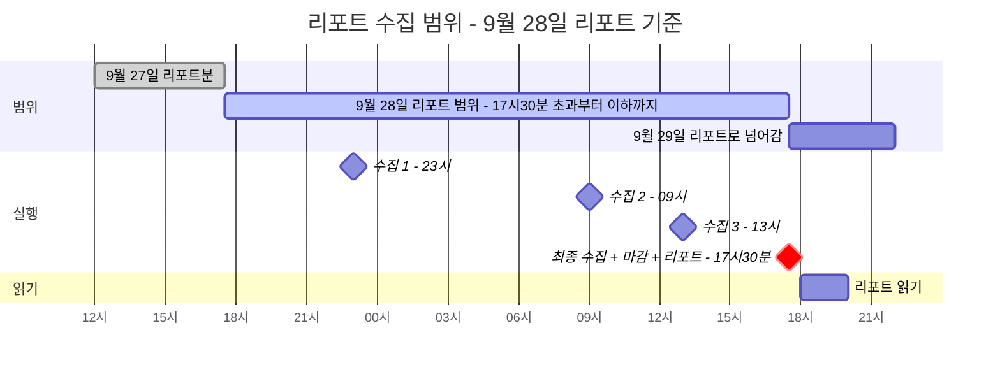
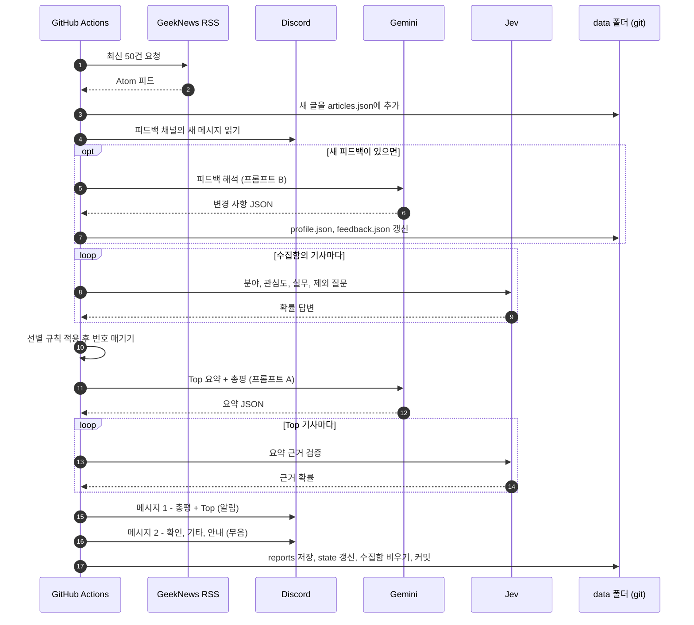

# 02. 실행 시각과 수집 범위

> 상태: 확정 · 최종 수정: 2026-09-28 · 관련 코드: `window.py`, `rss.py`, `.github/workflows/` · 관련 ADR: [ADR-004](decisions/ADR-004-cutoff-1730.md)

## 1. 실행 시각

| 실행 | KST | GitHub Actions cron (UTC) | 하는 일 |
|---|---|---|---|
| 수집 1 | 23:00 | `0 14 * * *` | 수집만 |
| 수집 2 | 09:00 | `0 0 * * *` | 수집만 |
| 수집 3 | 13:00 | `0 4 * * *` | 수집만 |
| 리포트 | 17:30 | `30 8 * * *` | 최종 수집 + 마감 + 리포트 전송 |
| 주간 보정 | 월요일 17:30 | 리포트 실행 안에서 처리 | 기준선 변경 제안 (FB-20~26) |

GitHub Actions의 cron은 UTC 기준이고, 서버가 붐비면 수십 분 늦게 시작될 수 있다. 그래서 리포트를 17:30에 시작해 18:00 전 도착을 노린다 (SCH-R5).

## SCH-D1 수집 범위 타임라인

**읽는 법**: 초록 막대가 9월 28일 리포트에 들어가는 글의 게시 시각 범위다. 자정은 경계가 아니다.

## 2. 범위 규칙

| ID | 규칙 |
|---|---|
| SCH-R1 | 경계 판단은 글의 `published` 시각(KST로 변환)으로 한다 |
| SCH-R2 | 오늘 리포트 범위 = `last_cutoff` **초과** ~ 오늘 17:30 KST **이하** |
| SCH-R3 | 마감 시각은 실제 실행 시각이 아니라 **17:30 KST로 고정**한다. 실행이 17:50에 시작돼도 마감은 17:30이고, 17:30~17:50 글은 내일 리포트로 간다 |
| SCH-R4 | 수집기는 `published > last_cutoff` 이고 수집함에 같은 `id`가 없을 때만 추가한다. 이 규칙으로 중복과 이미 보낸 글이 걸러진다 |
| SCH-R5 | 수집 간격은 17:30→23:00(5.5시간), 23:00→09:00(10시간), 09:00→13:00(4시간), 13:00→17:30(4.5시간)으로 최대 10시간이다. GeekNews는 RSS 50건이 대략 하루치라 누락이 없다. 18:00 전 도착을 위해 리포트는 17:30에 시작한다 |
| SCH-R6 | 리포트를 보낸 뒤 `last_cutoff`를 오늘 17:30으로 옮긴다. 전송이 실패하면 옮기지 않는다 → 다음 날 이틀치를 빠짐없이 가져간다 |
| SCH-R7 | 수집함에 있지만 마감 이후에 게시된 글(17:30 초과)은 수집함에 남겨 다음 리포트로 넘긴다 |
| SCH-R8 | 수동 실행(`--dry-run`, workflow_dispatch)은 `--cutoff` 인자로 마감 시각을 지정할 수 있고, dry-run은 state.json을 바꾸지 않는다 |

### 경계 사례 (테스트로 만든다)

| 사례 | 기대 결과 |
|---|---|
| 게시 시각이 정확히 어제 17:30:00 | 어제 리포트분. 오늘 범위 아님 (초과 조건) |
| 게시 시각이 정확히 오늘 17:30:00 | 오늘 범위 (이하 조건) |
| 오늘 17:30:01 게시, 17:45 실행 때 수집됨 | 수집함에 남고 내일 리포트로 (SCH-R7) |
| 어제 리포트 전송 실패 | `last_cutoff`가 그제 17:30 그대로 → 오늘 리포트에 이틀치 (SCH-R6) |
| 같은 글이 수집 1, 2에서 모두 보임 | 한 번만 저장 (SCH-R4) |
| RSS 시각이 UTC 또는 +09:00 표기 | 모두 KST로 변환 후 비교 (SCH-R1) |

## SCH-D2 17:30 리포트 실행 순서

**읽는 법**: 번호가 실제 코드의 실행 순서다. `report` 명령 하나가 1번부터 끝까지 처리한다. 피드백 해석이 Jev 판단보다 먼저 오는 이유는, 오늘 저녁 남긴 피드백을 다음 날 판단에 바로 쓰기 위해서다.

## 3. 동시 실행 방지

두 워크플로 모두 같은 `concurrency` 그룹(`gndigest-data`)을 쓰고 `cancel-in-progress: false`로 둔다. 겹치면 뒤 실행이 기다렸다가 돈다. 커밋 전에는 `git pull --rebase`로 최신 data를 받는다.

## 변경 이력

| 날짜 | 내용 |
|---|---|
| 2026-09-28 | 최초 작성. 마감 17:50 → 17:30, 수집 09·13·17:30 → 23·09·13시로 조정한 결과 반영 |
