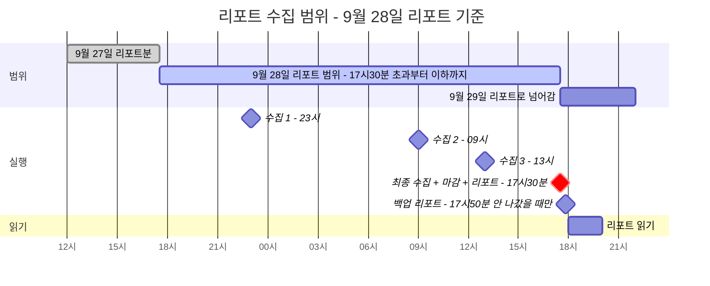
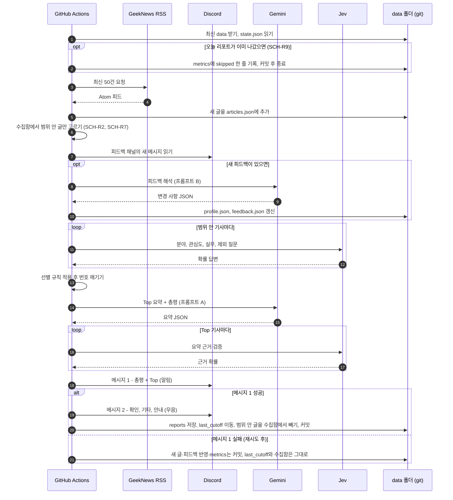

# 02. 실행 시각과 수집 범위

> 상태: 확정 · 최종 수정: 2026-09-30 · 관련 코드: `window.py`, `rss.py`, `.github/workflows/` · 관련 ADR: [ADR-004](decisions/ADR-004-cutoff-1730.md)

## 1. 실행 시각

| 실행 | KST | GitHub Actions cron (UTC) | 하는 일 |
|---|---|---|---|
| 수집 1 | 23:00 | `0 14 * * *` | 수집만 |
| 수집 2 | 09:00 | `0 0 * * *` | 수집만 |
| 수집 3 | 13:00 | `0 4 * * *` | 수집만 |
| 리포트 | 17:30 | `30 8 * * *` | 최종 수집 + 마감 + 리포트 전송 |
| 리포트 백업 | 17:50 | `50 8 * * *` | 오늘 리포트가 아직 안 나갔을 때만 리포트 실행과 같은 일. 이미 나갔으면 건너뜀 (SCH-R9) |
| 주간 보정 | 월요일 17:30 | 리포트 실행 안에서 처리 | 기준선 변경 제안 (FB-20~26) |

GitHub Actions의 cron은 UTC 기준이고, 서버가 붐비면 수십 분 늦게 시작되거나 드물게 아예 실행되지 않을 수 있다. 그래서 리포트를 17:30에 시작해 18:00 전 도착을 노리고 (SCH-R5), 17:30 실행이 빠지거나 크게 늦는 날을 위해 17:50에 백업 실행을 둔다 (SCH-R9). 수집 횟수는 그대로 하루 4회다.

## SCH-D1 수집 범위 타임라인

**읽는 법**: 초록 막대가 9월 28일 리포트에 들어가는 글의 게시 시각 범위다. 자정은 경계가 아니다. 백업 실행이 보내도 마감은 17:30 그대로다 (SCH-R3).

## 2. 범위 규칙

| ID | 규칙 |
|---|---|
| SCH-R1 | 경계 판단은 글의 `published` 시각(KST로 변환)으로 한다 |
| SCH-R2 | 오늘 리포트 범위 = `last_cutoff` **초과** ~ 오늘 17:30 KST **이하** |
| SCH-R3 | 마감 시각은 실제 실행 시각이 아니라 **17:30 KST로 고정**한다. 실행이 17:50에 시작돼도 마감은 17:30이고, 17:30~17:50 글은 내일 리포트로 간다. 마감은 **실행 시각 이전의 가장 최근 17:30**이다: 17:30 전(예: 10:00 수동 실행)이나 자정 넘어 시작한 실행은 전날 17:30이 마감이다. 아직 오지 않은 17:30을 마감으로 잡으면 그 사이 글이 `last_cutoff` 아래로 들어가 영영 빠지기 때문이다 |
| SCH-R4 | 수집기는 `published > last_cutoff` 이고 수집함에 같은 `id`가 없을 때만 추가한다. 이 규칙으로 중복과 이미 보낸 글이 걸러진다 |
| SCH-R5 | 수집 간격은 17:30→23:00(5.5시간), 23:00→09:00(10시간), 09:00→13:00(4시간), 13:00→17:30(4.5시간)으로 최대 10시간이다. GeekNews는 RSS 50건이 대략 하루치라 누락이 없다. 18:00 전 도착을 위해 리포트는 17:30에 시작한다 |
| SCH-R6 | 리포트 전송이 성공하면(메시지 1 성공, DSC-10) `last_cutoff`를 오늘 17:30으로 옮기고, 범위 안 글을 수집함에서 뺀다 (리포트 기록으로 옮겨짐). 전송이 실패하면 **둘 다 하지 않는다** → 범위 안 글이 수집함에 남아 다음 날 이틀치를 빠짐없이 보낸다. RSS에서 이미 밀려난 글은 다시 가져올 수 없으므로, 수집함에서 빼는 일은 반드시 전송 성공 뒤에 한다 |
| SCH-R7 | 수집함에 있지만 마감 이후에 게시된 글(17:30 초과)은 수집함에 남겨 다음 리포트로 넘긴다 |
| SCH-R8 | 수동 실행(`--dry-run`, workflow_dispatch)은 `--cutoff` 인자로 마감 시각을 지정할 수 있고, dry-run은 state.json을 바꾸지 않는다 |
| SCH-R9 | 리포트 실행은 시작할 때 원격의 최신 data를 받은 뒤(§3) `last_cutoff`가 이미 오늘 17:30 이상이면 **아무것도 보내지 않고** `skipped`를 기록한 뒤 끝낸다. 그래서 17:30 실행과 17:50 백업 실행 중 먼저 성공한 쪽만 리포트를 보낸다. dry-run은 이 검사를 하지 않는다 (SCH-R8) |

### 경계 사례 (테스트로 만든다)

| 사례 | 기대 결과 |
|---|---|
| 게시 시각이 정확히 어제 17:30:00 | 어제 리포트분. 오늘 범위 아님 (초과 조건) |
| 게시 시각이 정확히 오늘 17:30:00 | 오늘 범위 (이하 조건) |
| 오늘 17:30:01 게시, 17:45 실행 때 수집됨 | 수집함에 남고 내일 리포트로 (SCH-R7) |
| 어제 리포트 전송 실패 | `last_cutoff`가 그제 17:30 그대로 → 오늘 리포트에 이틀치 (SCH-R6) |
| 같은 글이 수집 1, 2에서 모두 보임 | 한 번만 저장 (SCH-R4) |
| RSS 시각이 UTC 또는 +09:00 표기 | 모두 KST로 변환 후 비교 (SCH-R1) |

### 마감 시각 사례 (테스트로 만든다)

| 실행 시작 | 마감 (SCH-R3) |
|---|---|
| 9월 28일 17:30:00 | 9월 28일 17:30 |
| 9월 28일 17:50 (백업 또는 지연) | 9월 28일 17:30 |
| 9월 28일 17:29:59 | 9월 27일 17:30 |
| 9월 28일 10:00 (수동) | 9월 27일 17:30 → 이미 보냈으면 건너뜀 (SCH-R9) |
| 9월 29일 00:10 (자정 넘어 지연) | 9월 28일 17:30 |

### 전송·중복 사례 (테스트로 만든다)

| 사례 | 기대 결과 |
|---|---|
| 메시지 1이 재시도 후에도 실패 | 메시지 2를 보내지 않음. `last_cutoff`와 수집함 그대로 → 다음 리포트에 이틀치 (SCH-R6, DSC-10) |
| 메시지 1 성공, 메시지 2만 재시도 후에도 실패 | 전송 성공으로 처리해 `last_cutoff` 이동·수집함 정리. 리포트 기록에 `msg2_failed: true`, 다음 리포트 안내 카드에 알림 (DSC-10) |
| 17:30 실행이 보낸 뒤 17:50 백업 실행 | 아무것도 보내지 않고 `skipped` 기록 (SCH-R9) |
| 17:30 예약 실행이 빠짐 | 17:50 백업 실행이 마감 17:30 범위로 보냄 (SCH-R3, SCH-R9) |
| 17:30 실행이 17:55에 늦게 시작, 17:50 백업이 먼저 보냄 | 늦게 시작한 실행은 `skipped` (SCH-R9) |
| 범위 안 글만 판단 | 수집함에 마감 이후 글이 있어도 Jev·요약에 넣지 않고 수집함에 남김 (SCH-R2, SCH-R7) |

## SCH-D2 17:30 리포트 실행 순서

**읽는 법**: 번호가 실제 코드의 실행 순서다. `report` 명령 하나가 1번부터 끝까지 처리한다. 17:50 백업 실행도 같은 순서를 따른다. 피드백 해석이 Jev 판단보다 먼저 오는 이유는, 오늘 저녁 남긴 피드백을 다음 날 판단에 바로 쓰기 위해서다. 메시지 2가 실패해도 메시지 1이 성공했으면 위쪽 칸으로 간다 (DSC-10).

## 3. 동시 실행 방지

두 워크플로 모두 같은 `concurrency` 그룹(`gndigest-data`)을 쓰고 `cancel-in-progress: false`로 둔다. 겹치면 뒤 실행이 기다렸다가 돈다. GitHub는 한 그룹에서 대기 실행을 하나만 두고, 더 새 대기 실행이 오면 이전 대기 실행을 취소한다. 실행 시각이 서로 떨어져 있어 보통은 문제가 되지 않고, 리포트 실행이 취소돼도 백업 실행이 이어받는다 (SCH-R9).

예약 실행은 대기하는 동안 체크아웃 시점의 data가 낡을 수 있다. 그래서 **실행을 시작할 때**(SCH-R9 검사 전)와 **커밋 전**에 `git pull --rebase`로 최신 data를 받는다.

## 변경 이력

| 날짜 | 내용 |
|---|---|
| 2026-09-28 | 최초 작성. 마감 17:50 → 17:30, 수집 09·13·17:30 → 23·09·13시로 조정한 결과 반영 |
| 2026-09-29 | SCH-R6 보완: 전송 성공 기준(메시지 1)과 수집함 정리 시점 명시. SCH-R9 추가: 17:50 백업 실행과 중복 전송 방지. 전송·중복 사례 표 추가. SCH-D1에 백업 실행, SCH-D2에 건너뛰기·범위 필터·전송 실패 분기 추가. §3에 대기 실행 취소 동작과 시작 시 pull 추가 |
| 2026-09-30 | SCH-R3 보완: 마감은 실행 시각 이전의 가장 최근 17:30 (17:30 전·자정 넘어 시작한 실행). 마감 시각 사례 표 추가 (사용자 결정, T02, L-20260930-1) |
