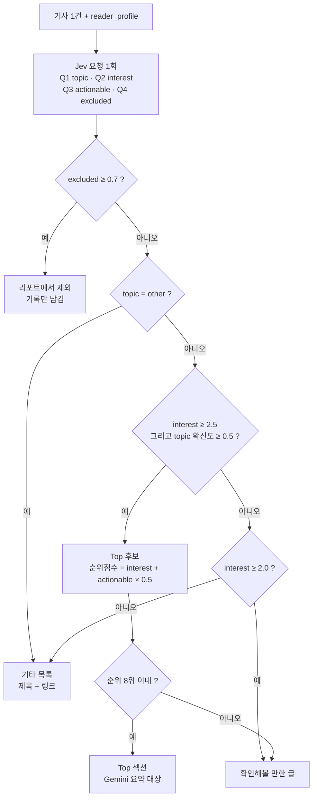

# 03. Jev 판단 설계

> 상태: 확정 · 최종 수정: 2026-09-28 · 관련 코드: `jev.py`, `selector.py`, `verify.py` · 관련 ADR: [ADR-002](decisions/ADR-002-jev-gemini-roles.md), [ADR-006](decisions/ADR-006-no-top-filling.md)

## 1. Jev란

글을 쓰지 않고, 상태(state)와 질문을 받아 **정해진 선택지 중 답과 확률**만 돌려주는 판단 모델이다. 질문 유형은 세 가지다.

| 유형 | 묻는 것 | 돌아오는 것 |
|---|---|---|
| Choice | 이 중 어느 것? | 고른 선택지, 선택지별 확률, confidence |
| Score | 순서 있는 등급에서 어디쯤? | 확률 가중 위치(0부터), 등급별 확률, confidence |
| Noul | 이 조건이 참인가? | 참일 확률 (0~1) |

한 요청 안의 질문들은 병렬로 답해지고 **서로의 답을 보지 못한다**. Jev는 이유를 설명하지 않는다. 설명이 필요하면 Gemini가 맡는다.

## 2. 호출 규칙

| ID | 규칙 |
|---|---|
| JEV-C1 | 엔드포인트 `POST https://openrouter.ai/api/alpha/decisions`, 헤더 `Authorization: Bearer $OPENROUTER_API_KEY` |
| JEV-C2 | 모델은 `typesafe/jev-1.13`으로 **고정**한다. `~typesafe/jev-latest`는 버전이 바뀌어 기준선이 흔들릴 수 있다 |
| JEV-C3 | 기사 1건 = 요청 1번, 질문 4개(Q1~Q4)를 한 요청에 담는다 |
| JEV-C4 | 판단은 17:30 리포트 실행 때 한다 (피드백 반영 직후) |
| JEV-C5 | criteria(기준 설명)는 영어로 쓴다. 한국어 성능은 OPEN-1에서 비교 후 결정 |
| JEV-C6 | 선택지 순서는 아래 표 순서로 **항상 고정**한다. 순서만 바꿔도 확률이 흔들린 사례가 보고됐다 |
| JEV-C7 | 응답은 pydantic으로 검증한다. 형식이 틀리면 1회 재시도 후 해당 기사는 `section: "other"`, `jev: null`로 둔다 (리포트는 계속) |
| JEV-C8 | 응답의 원본 확률 전부를 reports/날짜.json에 저장한다 (기준선 재조정용) |
| JEV-C9 | 429·5xx는 지수 백오프로 최대 2회 재시도, 기사 간 동시 요청은 최대 5개 |

비용: 공식 예시(질문 3개, 입력 476토큰)가 약 0.00002달러였다. 하루 50건 + 검증 8건이면 월 0.1달러 미만이다.

## 3. 상태(state) 구성

```json
{
  "title": "Atlas - 코딩 에이전트를 위한 소스 관리 도구",
  "summary": "코드 변경뿐 아니라 에이전트가 받은 요청…(HTML 제거, 최대 600자)",
  "type": "news",
  "reader_profile": {
    "interests": ["AI/LLM", "developer tools", "infrastructure/cloud", "hardware"],
    "likes": ["Rust", "AI 에이전트"],
    "dislikes": ["암호화폐"],
    "notes": ["벤치마크 수치가 있는 글 선호"]
  }
}
```

`reader_profile`은 profile.json에서 주제 이름만 뽑아 넣는다 (약 200토큰 이내, FB-05).

## 4. 질문 설계

### JEV-Q1 topic (Choice) — 분야

| 키 (순서 고정) | criteria (요청에 넣는 영어) | 뜻 |
|---|---|---|
| `ai_llm` | Machine learning models, LLMs, training or inference, AI agents, AI products and AI research. | AI/LLM |
| `dev_tools` | Programming languages, frameworks, libraries, IDEs, CLIs, testing, and software development practices. | 개발도구 |
| `infra_cloud` | Cloud platforms, servers, databases, networking, DevOps, deployment, and operations. | 인프라/클라우드 |
| `hardware` | CPUs, GPUs, chips, devices, semiconductor industry, and electronics or DIY hardware. | 하드웨어 |
| `other` | Topics unrelated to the four areas above, such as general science, society, politics, or business. | 기타 |

instructions: `Which area does this article mainly belong to?`

- 1순위 = `choice`, 확신도 = `confidence`
- **보조 태그**: 2순위 확률이 `secondary_tag_min_prob`(0.3) 이상이고 `other`가 아니면 보조 태그로 붙인다 (예: AI 칩 → 하드웨어 + AI/LLM)

### JEV-Q2 interest (Score) — 관심도 0~4

instructions: `How interesting is this article to the reader described in reader_profile?`

| 위치 | criteria | 뜻 |
|---|---|---|
| 0 | Outside the reader's interests, or matches a disliked topic. | 관심 밖 |
| 1 | Within the interests but a light opinion, chatter, or minor news. | 가벼운 글 |
| 2 | General news in the interests, such as a release or update. | 일반 소식 |
| 3 | New technology or an in-depth analysis in the interests. | 새 기술·깊은 분석 |
| 4 | Directly about a liked topic and also in-depth. | 좋아하는 주제 + 깊이 |

`score`(0.0~4.0 실수)를 관심도로 쓴다.

### JEV-Q3 actionable (Noul) — 실무 활용

instructions: `Can the reader try or apply this right away?`

| 값 | criteria |
|---|---|
| true | A tool, open-source project, technique, or release the reader can install or apply now. |
| false | News, opinion, industry trend, or research without something to try. |

### JEV-Q4 excluded (Noul) — 제외 주제

instructions: `Is this article mainly about a topic in reader_profile.dislikes?`

| 값 | criteria |
|---|---|
| true | The main subject matches one of the disliked topics. |
| false | The main subject is not a disliked topic, or dislikes is empty. |

`dislikes`가 비어 있으면 이 질문은 보내지 않고 `excluded = 0`으로 둔다.

### 요청 예시 (코드가 만드는 모양)

```json
{
  "model": "typesafe/jev-1.13",
  "state": { "title": "...", "summary": "...", "type": "news", "reader_profile": { } },
  "questions": {
    "topic": {
      "type": "choice",
      "instructions": "Which area does this article mainly belong to?",
      "criteria": {
        "ai_llm": "Machine learning models, LLMs, ...",
        "dev_tools": "Programming languages, frameworks, ...",
        "infra_cloud": "Cloud platforms, servers, ...",
        "hardware": "CPUs, GPUs, chips, ...",
        "other": "Topics unrelated to the four areas above, ..."
      }
    },
    "interest": {
      "type": "score",
      "instructions": "How interesting is this article to the reader described in reader_profile?",
      "criteria": ["Outside the reader's interests, ...", "...", "...", "...", "Directly about a liked topic and also in-depth."]
    },
    "actionable": {
      "type": "noul",
      "instructions": "Can the reader try or apply this right away?",
      "criteria": { "true": "...", "false": "..." }
    },
    "excluded": {
      "type": "noul",
      "instructions": "Is this article mainly about a topic in reader_profile.dislikes?",
      "criteria": { "true": "...", "false": "..." }
    }
  }
}
```

### 응답 예시

```json
{
  "model": "typesafe/jev-1.13-20260917",
  "answers": {
    "topic": { "type": "choice", "choice": "dev_tools", "confidence": 0.71,
               "probabilities": { "ai_llm": 0.34, "dev_tools": 0.61, "infra_cloud": 0.03, "hardware": 0.0, "other": 0.02 } },
    "interest": { "type": "score", "score": 3.2, "confidence": 0.64,
                  "probabilities": { "0": 0, "1": 0.02, "2": 0.1, "3": 0.52, "4": 0.36 } },
    "actionable": { "type": "noul", "noul": 0.88 },
    "excluded": { "type": "noul", "noul": 0.01 }
  },
  "usage": { "input_tokens": 612, "output_tokens": 80, "cost": 0.000026 }
}
```

## JEV-D1 기사 선별 흐름



**읽는 법**: 위에서부터 차례로 검사하고, 처음 걸리는 칸으로 간다. 숫자는 state.json의 `thresholds` 값이다.

## 5. 선별 규칙 (코드에서 처리)

| ID | 규칙 | 기준선 키 (기본값) |
|---|---|---|
| JEV-R1 | `excluded ≥ excluded_min` → `section: "excluded"`. 리포트에 안 나오고 기록만 | `excluded_min` 0.7 |
| JEV-R2 | `topic.choice == "other"` → `section: "other"` | - |
| JEV-R3 | `interest ≥ top_min_interest` 그리고 `topic.confidence ≥ topic_min_confidence` → Top 후보 | 2.5, 0.5 |
| JEV-R4 | Top 후보는 순위점수 `interest + actionable × 0.5` 내림차순, **최대 8개**. 초과분은 확인해볼 만한 글로 | - |
| JEV-R5 | Top 후보가 적어도 **기준 미달 글로 채우지 않는다**. 0개면 리포트에 "오늘은 관심 분야 글이 적었어요" | [ADR-006](decisions/ADR-006-no-top-filling.md) |
| JEV-R6 | 그 외 `interest ≥ maybe_min_interest` → `section: "maybe"` | 2.0 |
| JEV-R7 | 나머지 → `section: "other"` | - |
| JEV-R8 | 같은 순위점수면 게시 시각이 늦은 글이 앞 | - |
| JEV-R9 | 번호는 Top → maybe → other 순서로 1부터 이어서 매긴다. excluded는 번호 없음 | DSC-03 |

## 6. 요약 검증

### JEV-V1 요약 근거 검증 (Noul)

Gemini가 Top 요약을 만든 뒤, 요약마다 한 번 묻는다.

- state: `{ "source_summary": RSS 원문 요약, "generated_summary": Gemini 요약 }`
- instructions: `Is every claim in generated_summary supported by source_summary?`
- criteria true: `Every fact, number, and name in generated_summary appears in or directly follows from source_summary.`
- criteria false: `generated_summary adds or changes facts, numbers, names, or judgments not in source_summary.`

| ID | 규칙 | 기준선 키 |
|---|---|---|
| JEV-V2 | `noul < verify_min` → Gemini 요약 대신 RSS 원문 요약 앞부분(150자)을 쓰고 `summary_source: "rss"` | `verify_min` 0.7 |
| JEV-V3 | 검증 호출 자체가 실패하면 Gemini 요약을 쓰되 `verify: null`로 기록 | - |

## 7. 기준선 운영

- 위 숫자는 **시작용 임시값**이다. 반올림 숫자가 아니라 실수 비용을 보고 정한다.
- 원본 확률이 전부 저장되므로(JEV-C8), 기준선을 바꿔도 Jev를 다시 부를 필요가 없다.
- 기준선 변경은 주간 보정 제안(FB-20~26) → 내 승인으로만 한다.

## 변경 이력

| 날짜 | 내용 |
|---|---|
| 2026-09-28 | 최초 작성. "Top 5개 미만이면 다음 순위로 채움" 규칙을 폐기하고 JEV-R5로 확정 (ADR-006) |
