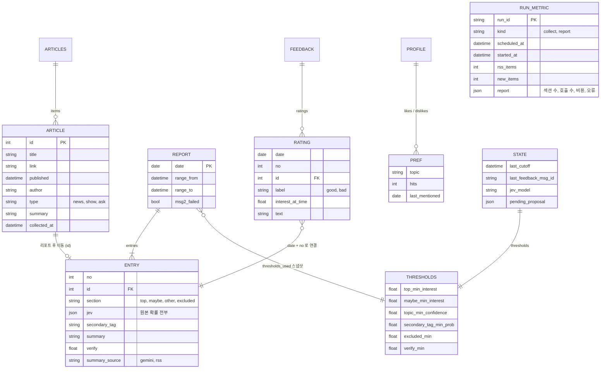

# 04. 데이터 구조

> 상태: 확정 · 최종 수정: 2026-09-29 · 관련 코드: `models.py`, `storage.py`, `metrics.py` · 관련 ADR: [ADR-005](decisions/ADR-005-json-in-git.md), [ADR-008](decisions/ADR-008-metrics-for-evidence.md)

모든 운영 데이터는 저장소의 `data/` 폴더에 JSON으로 두고, 실행이 끝날 때마다 커밋한다. 시각은 모두 `+09:00`이 붙은 ISO 8601 문자열이다.

```
data/
├─ articles.json   DATA-01 수집함 (리포트 전까지 대기)
├─ state.json      DATA-02 실행 상태 + 기준선
├─ profile.json    DATA-03 내 취향
├─ feedback.json   DATA-04 글별 평가 기록
├─ metrics.jsonl   DATA-06 실행 지표 (포트폴리오 증거)
└─ reports/
   └─ 2026-09-28.json  DATA-05 그날 리포트 기록
```

## DATA-D1 데이터 모델



**읽는 법**: 수집함의 글(ARTICLE)은 리포트가 나가면 그날 리포트 기록의 항목(ENTRY)으로 옮겨진다. 피드백 평가(RATING)는 "날짜 + 번호"로 ENTRY를 찾아간다.

## DATA-01 articles.json — 수집함

- 쓰는 곳: 모든 수집 실행 (추가), 리포트 실행 (전송 성공 시에만 범위 안 글 제거)
- 규칙: SCH-R4 (중복 제거), SCH-R6 (전송 실패 시 그대로 둠), SCH-R7 (마감 이후 글은 남김)

```json
{
  "items": [{
    "id": 34388,
    "title": "브라질, 온라인 베팅 금지",
    "link": "https://news.hada.io/topic?id=34388",
    "published": "2026-09-28T07:45:59+09:00",
    "author": "neo",
    "type": "news",
    "summary": "브라질 대통령이 온라인 베팅 영업을 금지하는 행정명령을 발표함…",
    "collected_at": "2026-09-28T09:00:12+09:00"
  }]
}
```

| 필드 | 만드는 법 |
|---|---|
| `id` | 링크의 `topic?id=` 숫자. id가 없는 항목은 건너뛴다 |
| `title` | RSS 제목의 HTML 엔터티를 푼다 (GeekNews는 CDATA 안에 `&amp;`처럼 한 번 더 이스케이프함, L-20260929-2) |
| `published` | RSS `published`를 KST로 변환 (SCH-R1). `updated`는 쓰지 않는다 (OPEN-4) |
| `type` | 제목이 `Show GN:`으로 시작하면 `show`, `Ask GN:`이면 `ask`, 나머지 `news` |
| `summary` | RSS `content`에서 HTML 태그 제거, 공백 정리. 블록 태그(`<li>`, `<p>` 등) 경계는 공백으로 바꾼다. GeekNews가 앞부분만 잘라 `...`로 끝나며 약 40~190자다 (L-20260929-1) |

## DATA-02 state.json — 실행 상태

```json
{
  "last_cutoff": "2026-09-28T17:30:00+09:00",
  "last_feedback_msg_id": "1290000000000000000",
  "jev_model": "typesafe/jev-1.13",
  "thresholds": {
    "top_min_interest": 2.5,
    "maybe_min_interest": 2.0,
    "topic_min_confidence": 0.5,
    "secondary_tag_min_prob": 0.3,
    "excluded_min": 0.7,
    "verify_min": 0.7
  },
  "pending_proposal": null
}
```

- `last_feedback_msg_id`: 피드백 채널에서 어디까지 읽었는지 (Discord 메시지 ID)
- `pending_proposal` 예시: `{"key": "top_min_interest", "from": 2.5, "to": 2.3, "reason": "좋음 평가 3건이 2.3~2.5 구간", "asked_at": "..."}`
- 최초 실행 시 파일이 없으면 `last_cutoff`를 "어제 17:30"으로 만든다.

## DATA-03 profile.json — 내 취향

```json
{
  "interests": ["ai_llm", "dev_tools", "infra_cloud", "hardware"],
  "likes": [
    {"topic": "Rust", "hits": 2, "last_mentioned": "2026-09-28"}
  ],
  "dislikes": [
    {"topic": "암호화폐", "hits": 1, "last_mentioned": "2026-09-28"}
  ],
  "notes": ["벤치마크 수치가 있는 글 선호"],
  "updated_at": "2026-09-28T17:31:05+09:00"
}
```

크기 관리 규칙은 [07 FB-05, FB-06](07-feedback-loop.md#2-취향-프로필-규칙)에 있다.

## DATA-04 feedback.json — 글별 평가

```json
{
  "ratings": [{
    "date": "2026-09-28",
    "no": 3,
    "id": 34372,
    "label": "bad",
    "interest_at_time": 2.8,
    "text": "3번 글은 별로였어",
    "recorded_at": "2026-09-29T17:30:40+09:00"
  }]
}
```

## DATA-05 reports/날짜.json — 리포트 기록

```json
{
  "date": "2026-09-28",
  "range": {"from": "2026-09-27T17:30:00+09:00", "to": "2026-09-28T17:30:00+09:00"},
  "thresholds_used": {"top_min_interest": 2.5, "maybe_min_interest": 2.0},
  "headline": "AI 에이전트 보안 사고가 이어진 하루",
  "trend": "…",
  "discord_message_ids": ["...", "..."],
  "msg2_failed": false,
  "entries": [{
    "no": 1,
    "id": 34365,
    "section": "top",
    "title": "그렇다, Claude는 입자물리학의 9루프 계산을 할 수 있다",
    "link": "https://news.hada.io/topic?id=34365",
    "published": "2026-09-27T23:39:12+09:00",
    "type": "news",
    "jev": {
      "topic": {"choice": "ai_llm", "confidence": 0.82,
                "probabilities": {"ai_llm": 0.88, "dev_tools": 0.03, "infra_cloud": 0.01, "hardware": 0.02, "other": 0.06}},
      "interest": {"score": 3.4, "confidence": 0.7, "probabilities": {"0": 0, "1": 0, "2": 0.1, "3": 0.4, "4": 0.5}},
      "actionable": 0.21,
      "excluded": 0.02
    },
    "rank_score": 3.5,
    "secondary_tag": null,
    "summary": "Gemini가 쓴 요약…",
    "why": "AI의 과학 연구 활용 사례로 볼 만함",
    "verify": 0.91,
    "summary_source": "gemini"
  }]
}
```

- Top이 아닌 항목은 `summary`, `why`, `verify`가 `null`이다.
- 이 파일은 리포트 전송이 성공했을 때(메시지 1 성공)만 만든다 (SCH-R6).
- `msg2_failed`: 메시지 2가 재시도 후에도 실패하면 `true`. 다음 리포트 실행이 가장 최근 리포트의 이 값을 보고 안내 카드를 붙인다 (DSC-10).
- `thresholds_used`에는 그날 쓴 기준선 전체를 복사한다.

## DATA-06 metrics.jsonl — 실행 지표

포트폴리오 결과 수치의 원본이다 ([ADR-008](decisions/ADR-008-metrics-for-evidence.md)). 실행 1번 = 한 줄(JSON), **덧붙이기만** 한다.

```json
{"run_id": "2026-09-28T17:30-report", "kind": "report",
 "scheduled_at": "2026-09-28T17:30:00+09:00", "started_at": "2026-09-28T17:34:12+09:00", "finished_at": "2026-09-28T17:36:40+09:00",
 "rss_items": 50, "new_items": 6,
 "rss_oldest_published": "2026-09-27T21:35:36+09:00", "rss_newest_published": "2026-09-28T17:12:03+09:00",
 "report": {
   "range_from": "2026-09-27T17:30:00+09:00", "range_to": "2026-09-28T17:30:00+09:00",
   "total": 47, "top": 7, "maybe": 6, "other": 34, "excluded": 0,
   "jev_calls": 54, "jev_errors": 0, "jev_cost_usd": 0.0011, "jev_latency_ms_p50": 180,
   "gemini_calls": 2, "gemini_429": 0, "gemini_fallback": false,
   "verify_replaced": 1, "feedback_messages": 2,
   "discord_msg1_sent_at": "2026-09-28T17:36:31+09:00"
 }}
```

- 수집 실행(`kind: collect`)에는 `report`가 없다.
- 리포트 실행이 SCH-R9로 건너뛰면 `"skipped": "already_sent"`를 넣고 `report`는 없다. 17:50 백업 실행도 `kind: report`이고 `scheduled_at`으로 구분한다.
- 실패한 실행도 기록한다 (`"error": "요약 단계 429 재시도 초과"` 같은 한 줄 요약). 비밀값·원문 응답은 넣지 않는다.
- 이 파일은 365일 보관한다 (한 줄 약 1KB).

## 1. 저장·보관 규칙

| ID | 규칙 |
|---|---|
| DATA-R1 | 파일은 임시 파일에 쓴 뒤 이름을 바꾸는 방식(원자적 저장)으로 저장한다 |
| DATA-R2 | 읽을 때 pydantic으로 검증한다. 깨진 파일이면 실행을 멈추고 오류를 남긴다 (조용히 덮어쓰지 않는다) |
| DATA-R3 | reports와 feedback의 ratings는 90일 보관, 리포트 실행 때 오래된 것 삭제 |
| DATA-R4 | 주간 보정은 최근 4주(28일) 데이터만 쓴다 |
| DATA-R5 | 실행 끝에 `data/` 변경만 커밋한다. 커밋 메시지: `data: report 2026-09-28` / `data: collect 2026-09-28 09:00` |
| DATA-R6 | 비밀값은 data에 절대 쓰지 않는다 (ARCH-S1) |
| DATA-R7 | JSON은 UTF-8, 들여쓰기 2칸, `ensure_ascii=False` (폰에서 한글이 읽히게) |

## 변경 이력

| 날짜 | 내용 |
|---|---|
| 2026-09-28 | 최초 작성. 아키텍처의 articles.json을 수집함(DATA-01)과 리포트 기록(DATA-05)으로 분리 |
| 2026-09-28 | 포트폴리오 증거용 실행 지표 DATA-06 추가, DATA-D1에 RUN_METRIC 추가 (ADR-008) |
| 2026-09-29 | T01: DATA-01 필드 표에 `title`·`published` 처리와 `summary` 실제 길이 추가 (OPEN-4, L-20260929-1·2) |
| 2026-09-29 | DATA-01 수집함 정리를 전송 성공 시로 한정(SCH-R6). DATA-05에 `msg2_failed` 추가(DSC-10), DATA-D1 REPORT 갱신. DATA-06에 `skipped` 기록 추가(SCH-R9) |
