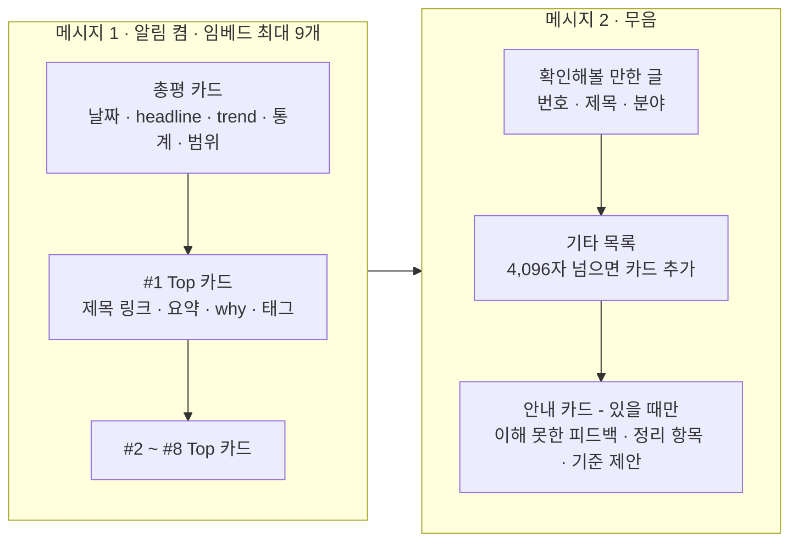

# 06. Discord 리포트 양식

> 상태: 확정 · 최종 수정: 2026-09-28 · 관련 코드: `report.py`, `discord_client.py` · 관련 ADR: [ADR-003](decisions/ADR-003-discord-text-feedback.md)

## 1. 채널 구성

| ID | 채널 | 권한 |
|---|---|---|
| DSC-01 | 리포트 채널 | 봇만 쓰기, 나는 읽기 전용 |
| DSC-02 | 피드백 채널 | 나는 자유롭게 쓰기, 봇은 읽기 + 안내 답장 |

봇 설정: Developer Portal에서 **Message Content Intent** 켜기, 두 채널에 `View Channel`, `Send Messages`, `Embed Links`, `Read Message History` 권한.

## DSC-D1 리포트 구성



**읽는 법**: 리포트는 메시지 2개다. 폰 알림은 메시지 1에서만 울린다.

## 2. 양식 규칙

| ID | 규칙 |
|---|---|
| DSC-03 | 번호는 Top → 확인해볼 만한 글 → 기타 순으로 1부터 이어서 매긴다 (JEV-R9) |
| DSC-04 | 메시지 1 = 총평 카드 + Top 카드(최대 8) = 임베드 최대 9개. 메시지 2 = 확인·기타·안내 카드 |
| DSC-05 | 메시지 2는 `flags: 4096`(SUPPRESS_NOTIFICATIONS)으로 무음 전송 |
| DSC-06 | 카드 제목은 GeekNews 글 페이지(`link`)로 연결 |
| DSC-07 | Gemini 실패 날은 총평 카드에 "원문 요약으로 대체됨" 표시 (GEM-F1) |
| DSC-08 | Top 0개인 날은 총평 카드 아래 "오늘은 관심 분야 글이 적었어요" (JEV-R5) |
| DSC-09 | 안내 카드는 내용이 있을 때만 붙인다: 이해 못한 피드백, 정리된 취향 항목, 기준 변경 제안, 무시된 평가 |
| DSC-10 | 전송 실패 시 2회 재시도. 메시지 1만 성공하고 2가 실패하면 메시지 2만 다시 보낸다. 둘 다 실패하면 `last_cutoff`를 옮기지 않는다 (SCH-R6) |

## 3. 카드별 내용

**총평 카드** (색 `0x888780`)
- 제목: `GeekNews 데일리 · 9월 28일 (월)`
- 설명: headline(굵게) + trend
- 하단: `47건 수집 · Top 7 · 확인 6 · 기타 34 | 범위: 어제 17:30 ~ 오늘 17:30`

**Top 카드** (색 = 주 분야)
- 제목: `#1 {title}` + url
- 설명: `{summary}` + 빈 줄 + `💡 {why}`
- 하단(footer): `AI/LLM · 개발도구 · 바로 써보기` (주 분야 · 보조 태그 · actionable ≥ 0.5이면 "바로 써보기")

**확인해볼 만한 글 / 기타 목록** (색 `0x888780`, `0xB4B2A9`)
- 한 줄에 한 글: `[#9 제목](link) · 개발도구`
- 기타 목록은 분야 표시 없이 `[#15 제목](link)`

**안내 카드** (색 `0xEF9F27`)
- 예: `이해하지 못한 피드백: "그거 좀 줄여줘"`, `정리된 취향 항목: 블록체인 (60일 미언급)`, `기준 변경 제안: Top 기준 2.5 → 2.3. 피드백 채널에 승인/거절을 남겨주세요`

## 4. 분야 색

| 분야 | 키 | 색 |
|---|---|---|
| AI/LLM | `ai_llm` | `0x7F77DD` 보라 |
| 개발도구 | `dev_tools` | `0x1D9E75` 청록 |
| 인프라/클라우드 | `infra_cloud` | `0xD4537E` 분홍 |
| 하드웨어 | `hardware` | `0xD85A30` 주황 |

색 배지는 Discord 임베드가 지원하지 않는다. 보조 태그와 "바로 써보기"는 footer 텍스트로 표시한다.

## 5. Discord 제한 (코드에서 지킨다)

| 항목 | 한도 | 처리 |
|---|---|---|
| 메시지당 임베드 | 10개 | 메시지 1은 최대 9개 |
| 메시지당 임베드 글자 합계 | 6,000자 | 넘으면 Top 카드를 메시지 1과 1-2로 나눈다 |
| 임베드 제목 | 256자 | 자르고 `…` |
| 임베드 설명 | 4,096자 | 기타 목록이 넘으면 카드를 추가 |
| footer | 2,048자 | - |

## 6. 모습 예시 (텍스트 스케치)

```
┃ GeekNews 데일리 · 9월 28일 (월)
┃ **AI 에이전트 보안 사고가 이어진 하루**
┃ 에이전트 권한 남용 사례와 의사결정 모델 관련 글이 여러 건 올라옴.
┃ 47건 수집 · Top 7 · 확인 6 · 기타 34 | 범위: 어제 17:30 ~ 오늘 17:30

┃ #1 그렇다, Claude는 입자물리학의 9루프 계산을 할 수 있다   (보라)
┃ 어려운 입자물리 계산 도전에 9루프 산란 진폭 계산으로 응답함…
┃ 💡 AI의 과학 연구 활용 사례로 볼 만함
┃ AI/LLM

┃ #2 Atlas - 코딩 에이전트를 위한 소스 관리 도구               (청록)
┃ …
┃ 개발도구 · AI/LLM · 바로 써보기
```

## 변경 이력

| 날짜 | 내용 |
|---|---|
| 2026-09-28 | 최초 작성 |
