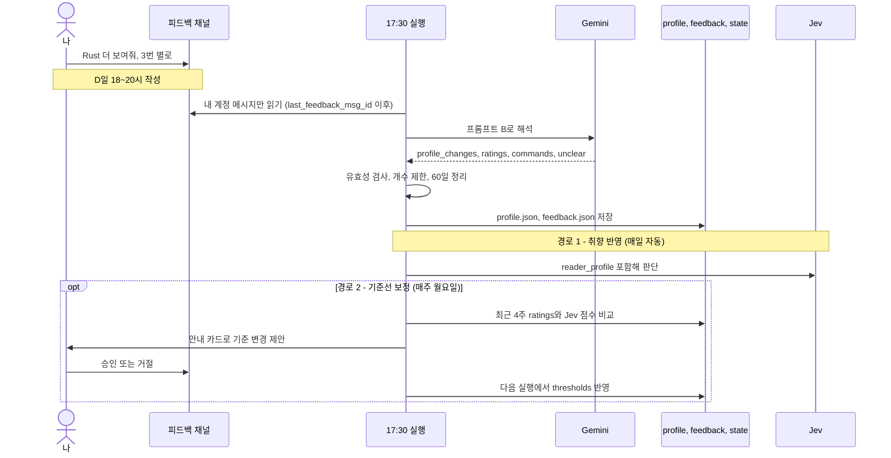

# 07. 피드백 반영 구조

> 상태: 확정 · 최종 수정: 2026-09-28 · 관련 코드: `feedback.py`, `prefs.py`, `tuning.py` · 관련 ADR: [ADR-003](decisions/ADR-003-discord-text-feedback.md)

## 1. 핵심 개념

**Jev 모델 자체는 피드백으로 학습하지 않는다.** 모델 내부(가중치)는 그대로이고, 우리가 바꾸는 것은 두 가지다.

| 경로 | 바꾸는 것 | 주기 | 방식 |
|---|---|---|---|
| 경로 1 · 취향 반영 | Jev에 주는 정보 (`reader_profile`) | 매일 | 자동 |
| 경로 2 · 기준선 보정 | 확률을 자르는 숫자 (`thresholds`) | 매주 월요일 | 제안 → 내 승인 |

경로 1은 **무엇을 좋아하는지**, 경로 2는 **얼마나 까다롭게 고를지**를 고친다.

## FB-D1 피드백 반영 흐름

**읽는 법**: D일 저녁에 남긴 피드백은 D+1일 17:30 실행 맨 앞에서 처리되고, 같은 실행의 Jev 판단부터 바로 쓰인다.

## 2. 취향 프로필 규칙

| ID | 규칙 |
|---|---|
| FB-01 | 피드백은 피드백 채널에 자유 텍스트로 남긴다. 이모지 반응은 쓰지 않는다 |
| FB-02 | `DISCORD_OWNER_USER_ID`가 쓴 메시지만 읽는다. 봇·다른 사람 메시지는 무시 |
| FB-03 | 변경된 프로필은 같은 실행의 Jev `reader_profile`에 바로 들어간다 |
| FB-04 | 적용 순서: `remove_*` → `merge` → `add_*`. 추가하려는 주제가 반대 목록에 있으면 그 목록에서 빼고 옮긴다 (싫어요 → 좋아요) |
| FB-05 | 크기 제한: `likes`·`dislikes` 각 15개, `notes` 5개, 주제 20자. 넘치면 `hits`가 낮은 것 → `last_mentioned`가 오래된 것 순으로 뺀다 |
| FB-06 | 60일 동안 다시 언급되지 않은 항목은 자동 정리하고, 안내 카드에 "정리된 취향 항목: ○○"로 알린다 |
| FB-07 | 이미 있는 주제가 다시 언급되면 `hits + 1`, `last_mentioned` 갱신 |

## 3. 글별 평가 규칙

| ID | 규칙 |
|---|---|
| FB-10 | "3번 별로" → 가장 최근 리포트의 3번, "어제 3번" → 그 날짜 리포트의 3번 |
| FB-11 | 리포트 파일에 없는 번호는 버리고 안내 카드에 "무시된 평가: 9월 28일 40번 (없는 번호)" |
| FB-12 | 저장할 때 그 글의 당시 관심도(`interest_at_time`)와 섹션을 같이 기록한다 |

## 4. 주간 보정 규칙 (경로 2)

매주 월요일 리포트 실행에서 최근 28일 평가를 본다. 한 번에 **제안 1개**만 한다.

| ID | 조건 | 제안 |
|---|---|---|
| FB-20 | Top이 아니었던 글에 "좋음"이 3건 이상이고, 그 글들의 관심도가 `top_min_interest - 0.3` 이상 | `top_min_interest`를 0.2 낮추기 |
| FB-21 | Top 글에 "별로"가 3건 이상이고, 그 글들의 관심도가 `top_min_interest + 0.3` 미만 | `top_min_interest`를 0.2 올리기 |
| FB-22 | 두 조건이 동시에 맞으면 제안하지 않는다 (신호가 엇갈림) | - |
| FB-23 | `top_min_interest`는 1.5~3.5 사이, 항상 `maybe_min_interest + 0.3` 이상 | - |
| FB-24 | 제안은 `state.pending_proposal`에 저장하고 안내 카드로 알린다. 대기 중인 제안이 있으면 새 제안을 만들지 않는다 |
| FB-25 | 피드백 채널에 "승인" → 다음 실행에서 적용, "거절" → 폐기. 7일 동안 답이 없으면 자동 폐기 |
| FB-26 | 적용·폐기 결과는 다음 리포트 안내 카드로 알리고, 그날 reports/날짜.json의 `thresholds_used`로 남는다 |

## 5. 명령

| 명령 (자유 표현 가능) | 분류 | 동작 |
|---|---|---|
| "내 프로필 보여줘" | `show_profile` | 피드백 채널에 현재 좋아요·싫어요·메모 목록을 답장 |
| "승인" | `approve` | 대기 중인 기준 변경 적용 |
| "거절" | `reject` | 대기 중인 기준 변경 폐기 |

**주의**: 상시 접속 봇이 아니라서 답장은 즉시 오지 않고 다음 17:30 실행 때 온다.

## 변경 이력

| 날짜 | 내용 |
|---|---|
| 2026-09-28 | 최초 작성. 이모지 반응 대신 텍스트 피드백, 번호 매기기, 프로필 크기 관리 확정 |
