# 08. 구현 계획 (로컬 → 클라우드)

> 상태: 확정 · 최종 수정: 2026-09-29 · 관련 ADR: [ADR-007](decisions/ADR-007-local-first.md), [ADR-008](decisions/ADR-008-metrics-for-evidence.md)

## 1. 진행 방식

1. **Phase 0~2는 로컬**에서 Claude Code로 구현하고 테스트까지 마친다.
2. **Phase 3**에서 GitHub Actions로 자동 실행을 붙이고, 이후 수정은 폰의 클라우드 세션에서 한다.
3. **Phase 4**는 운영하면서 포트폴리오 증거를 모으고 PDF를 만든다.
4. 작업 하나 = Claude Code 세션 하나 = PR 하나. 작업이 끝날 때마다 worklog.md에 기록이 남는다.
5. 모든 작업은 **지표 기록**(DATA-06)과 **문제 해결 로그**(portfolio/logs) 규칙을 함께 지킨다 (CLAUDE.md).

## PLAN-D1 구현 로드맵

```mermaid
flowchart LR
  subgraph P0["Phase 0 · 로컬 준비"]
    T00["T00 저장소 · 환경 · CLI 뼈대"]
  end
  subgraph P1["Phase 1 · 로컬 구현 (단위 테스트)"]
    T01["T01 RSS 수집"] --> T02["T02 범위 · 상태"]
    T02 --> T03["T03 Jev 판단"]
    T03 --> T04["T04 선별 · 번호"]
    T04 --> T05["T05 Gemini 요약"]
    T05 --> T06["T06 요약 검증"]
    T06 --> T07["T07 Discord 전송"]
    T07 --> T08["T08 피드백 해석"]
    T08 --> T09["T09 명령 · 주간 보정"]
  end
  subgraph P2["Phase 2 · 로컬 통합 테스트"]
    T10["T10 dry-run · 실제 API E2E"]
  end
  subgraph P3["Phase 3 · 자동화 · 이관"]
    T11["T11 GitHub Actions"] --> T12["T12 클라우드 세션 이관"]
  end
  subgraph P4["Phase 4 · 운영 · 포트폴리오"]
    T13["T13 측정 실험 · 증거"] --> T14["T14 포트폴리오 초안 · PDF"]
  end
  T00 --> T01
  T09 --> T10
  T10 --> T11
  T12 --> T13
```



**읽는 법**: 왼쪽에서 오른쪽으로 진행한다. Phase 1은 한 줄로 이어져 있어 앞 작업의 결과를 다음 작업이 쓴다.

## 2. 작업 목록

각 작업의 **완료 조건**을 모두 만족해야 다음 작업으로 넘어간다.

### T00 저장소 · 환경 · CLI 뼈대
- 기준: 01 §4~5, ARCH-S1, REQ-14
- 산출물: `pyproject.toml`(uv), `src/gndigest/` 패키지, `cli.py`(collect/report/tune/show-profile 빈 명령 + `--dry-run`, `--cutoff`), `config.py`, `.env.example`, `.gitignore`(`.env`, `out/`), `tests/`, `data/` 초기 파일
- 완료 조건: `uv run gndigest --help` 동작, `uv run pytest` 통과(빈 테스트), 인터넷 없이 테스트 실행 가능
- 테스트: 설정 로딩(환경변수 누락 시 명확한 오류)
- 지표·포트폴리오: `metrics.py` 뼈대(DATA-06 한 줄 기록 함수), `experiments/` 폴더, `tools/figgen.py`와 `tools/portfolio`(npm install → npm run figures → npm run pdf)가 그대로 실행되는지 확인

### T01 RSS 수집
- 기준: ARCH-02, DATA-01, SCH-R1, SCH-R4
- 산출물: `rss.py`, `storage.py`, `models.py`(Article), `tests/fixtures/rss_sample.xml`(실제 피드 저장본), `collect --feed-file`(저장본으로 실행)
- 완료 조건: `gndigest collect --dry-run`이 fixture로 수집함 결과를 `out/`에 쓴다. id·type·summary 추출 정확
- 테스트: Show GN/Ask GN 판별, HTML 제거, 중복 id 무시, 원자적 저장
- 확인: OPEN-4 (`published` vs `updated`)
- 지표: `rss_items`, `new_items`, `rss_oldest_published`, `rss_newest_published` (P1 증거)

### T02 범위 · 상태
- 기준: SCH-R1~R9, DATA-02
- 산출물: `window.py`, State 모델, 최초 실행 시 state 생성
- 완료 조건: 02 §2의 경계 사례 표 6개가 모두 테스트로 존재하고 통과
- 테스트: 경계 초과/이하, 마감 고정, 02 §2 마감 시각 사례(17:30 전·자정 넘어 시작), 전송 실패 시 cutoff·수집함 유지, 마감 이후 글 잔류, 오늘 리포트를 이미 보냈는지 판별(SCH-R9)

### T03 Jev 판단
- 기준: JEV-C1~C9, JEV-Q1~Q4
- 산출물: `jev.py`(요청 빌더, 응답 파서, 재시도), `tests/fixtures/jev_*.json`
- 완료 조건: 가짜 응답으로 단위 테스트 통과 + **실제 API로 기사 10건 스모크 테스트**(로컬, 수동) 결과를 worklog에 표로 기록
- 테스트: 선택지 순서 고정, dislikes 없을 때 Q4 생략, 형식 오류 시 fallback, 보조 태그 계산
- 확인: OPEN-1 (한국어 vs 영어 criteria 비교), OPEN-5
- 지표: `jev_calls`, `jev_errors`, `jev_cost_usd`(`usage.cost` 합), `jev_latency_ms_p50` (P2 증거). 스모크 테스트 결과는 `portfolio/evidence/R1/`에도 남긴다

### T04 선별 · 번호
- 기준: JEV-R1~R9, JEV-D1, DSC-03
- 산출물: `selector.py`
- 완료 조건: JEV-D1의 모든 분기(제외/기타/Top/8위 초과/확인/기타)가 테스트로 존재
- 테스트: Top 0개일 때 채우지 않음(JEV-R5), 동점 처리, 번호 연속성

### T05 Gemini 요약
- 기준: GEM-C1~C4, GEM-A1~A4, GEM-F1, GEM-F3
- 산출물: `summarizer.py`, `prompts/report_summary.txt`
- 완료 조건: 가짜 응답 테스트 통과 + 실제 호출 1회 결과를 `out/`에 저장해 확인
- 테스트: 번호 불일치 처리, 길이 자르기, 429 재시도 후 RSS 대체
- 확인: OPEN-2 (모델 이름·한도)
- 지표: `gemini_calls`, `gemini_429`, `gemini_fallback` (P2 증거)

### T06 요약 검증
- 기준: JEV-V1~V3
- 산출물: `verify.py`
- 완료 조건: 원문에 없는 숫자를 넣은 가짜 요약이 RSS 요약으로 대체되는 테스트 통과
- 지표: `verify_replaced` (P3 증거). 리포트 기록에 원문 요약·Gemini 요약·verify가 모두 남아 라벨링할 수 있어야 한다

### T07 Discord 전송
- 기준: DSC-01~10, 06 §5
- 산출물: `report.py`(임베드 빌더), `discord_client.py`(전송, 무음 플래그, 재시도)
- 완료 조건: `--dry-run`이면 `out/report-preview.md`와 `out/discord_payload.json`만 쓴다. 실제 모드로 **테스트용 Discord 서버**에 1회 전송 성공
- 테스트: 6,000자·10개 제한 분할, 기타 목록 4,096자 초과 시 카드 추가, 메시지 2만 재전송, 메시지 1 실패 시 메시지 2 미전송·cutoff 유지, 메시지 2만 실패 시 `msg2_failed` 기록과 다음 리포트 안내 카드 (DSC-10)
- 확인: OPEN-3 (게이트웨이 1회 연결 필요 여부)
- 지표: `discord_msg1_sent_at` (R2 증거)

### T08 피드백 해석
- 기준: GEM-B1~B3, FB-01~07, FB-10~12, DATA-03, DATA-04
- 산출물: `feedback.py`, `prefs.py`, `prompts/feedback_parse.txt`
- 완료 조건: 05의 예시 입력이 예시 출력대로 profile·feedback에 반영되는 테스트 통과
- 테스트: 작성자 필터, 반대 목록 이동, 15개 초과 정리, 60일 정리, 없는 번호 무시, 해석 실패 시 msg_id 유지
- 지표: `feedback_messages` (P4 증거)

### T09 명령 · 주간 보정
- 기준: FB-20~26, 07 §5
- 산출물: `tuning.py`, show-profile 답장
- 완료 조건: FB-20~23 조건별 테스트, 승인·거절·7일 만료 테스트 통과

### T10 로컬 통합 테스트
- 기준: SCH-D2 전체
- 산출물: `tests/test_e2e.py`(모든 외부 호출 가짜), 수동 E2E 체크리스트 결과
- 완료 조건:
  - 가짜 응답 E2E: collect 3회 → report 1회 → 피드백 → 다음 report까지 통과
  - 02 §2 **전송·중복 사례** 표가 모두 가짜 응답 E2E로 존재하고 통과
  - 실제 API E2E: 테스트 Discord 서버로 `gndigest report` 실제 실행, 폰에서 리포트 확인
  - 문서 상태를 `구현됨`으로 바꾸고 미결 사항(OPEN) 결과 기록

### T11 GitHub Actions
- 기준: 02 §1, §3, SCH-R9, ARCH-S1, DATA-R5
- 산출물: `.github/workflows/collect.yml`, `report.yml`(cron 17:30 + 17:50 백업, workflow_dispatch + `dry_run` 입력), `ci.yml`(PR마다 pytest)
- 완료 조건: Secrets 등록, 수동 실행(dry-run) 성공, 다음 날 예약 실행이 18:00 전 도착, 같은 날 17:50 백업 실행이 `skipped`로 끝남
- 테스트: concurrency 설정 확인, 실행 시작 시와 커밋 전 `pull --rebase`
- 지표: `scheduled_at`(워크플로의 cron 예약 시각), `started_at` (R2 증거)

### T12 클라우드 세션 이관
- 기준: ADR-007
- 산출물: 3절 체크리스트 완료, worklog 기록
- 완료 조건: 폰에서 클라우드 세션으로 작은 변경(예: 안내 문구 수정) 1건을 PR → CI 통과 → 병합 → 다음 리포트에 반영

### T13 측정 실험 · 증거 (운영 1~4주)
- 기준: portfolio/README.md §6, 각 후보의 "측정 계획", ADR-008
- 산출물: `experiments/p1_coverage.py`, `p2_naive_gemini.py`, `p3_labels_export.py`, `p4_weekly.py`, (예비) `r1_order_bias.py`, `r2_delay.py` — 각각 `portfolio/evidence/`에 원본 CSV와 측정 설명 파일을 만든다
- 완료 조건: 후보마다 측정 설명 파일(evidence/README.md 형식)이 있고, 숫자를 스크립트로 다시 만들 수 있다
- 주의: 실험 스크립트는 **테스트가 아니다**. 실제 API를 부르는 실험은 사용자 승인 후 로컬에서 1회 실행한다. P3 라벨은 사용자가 직접 채운다

### T14 포트폴리오 초안 · PDF
- 기준: portfolio/README.md, STYLE-GUIDE.md
- 산출물: 증거가 모인 후보의 5단계 초안(상태 `초안`), 결과 수치를 반영한 그림 명세·SVG·PNG, 초안 PDF (`tools/portfolio`의 `npm run figures`, `npm run pdf` — 도구는 설계 단계에서 준비됨)
- 완료 조건: 사용자가 4개를 골라 `확정`으로 바꾸고 `pdf.config.json`에 순서를 정한 뒤, `node build-pdf.mjs --final`로 PDF 1개(요약 1쪽 + 경험 4쪽)가 만들어진다
- 주의: `확정` 항목의 문장은 Claude Code가 고치지 않는다

## 3. 클라우드 세션 이관 체크리스트

- [ ] GitHub 저장소에 push, Claude GitHub App 연결
- [ ] CLAUDE.md, docs/가 최신이고 모든 문서 상태가 `구현됨`
- [ ] `uv run pytest`가 **인터넷 없이** 통과 (클라우드 세션은 기본적으로 네트워크 접근이 제한된다)
- [ ] 실제 API 호출은 GitHub Actions에서만 일어나고, 클라우드 세션에는 API 키를 두지 않는다
- [ ] `report.yml`의 수동 실행 + `dry_run: true`로 PR 브랜치 결과를 확인하는 방법을 README에 적어둠
- [ ] ci.yml이 PR마다 테스트를 돌린다

## 4. 폰에서의 작업 흐름 (이관 후)

1. 리포트를 읽다가 개선점이 떠오르면 → 해당 문서 ID를 찾는다 (docs/README.md 다이어그램 목록)
2. 클라우드 세션에 "문서 07의 FB-05를 20개로 바꿔줘"처럼 **ID로 지시**한다
3. Claude Code는 CLAUDE.md 규칙대로 문서 → 코드 → 테스트 → worklog 순으로 작업하고 PR을 연다
4. PR에서 문서 변경과 다이어그램을 먼저 보고, 테스트 통과를 확인한 뒤 병합한다

## 5. Claude Code 지시 템플릿

```
작업: T03 Jev 판단
기준 문서: docs/03-jev-decisions.md (JEV-C1~C9, JEV-Q1~Q4)
CLAUDE.md의 작업 절차를 따를 것.
완료 조건은 docs/08-implementation-plan.md의 T03 항목.
끝나면 worklog.md에 기록하고, 문서와 다르게 구현한 부분이 있으면 멈추고 먼저 알려줘.
```

## 변경 이력

| 날짜 | 내용 |
|---|---|
| 2026-09-28 | 최초 작성 |
| 2026-09-28 | 포트폴리오 반영: 작업별 지표, Phase 4(T13·T14), PLAN-D1 갱신 (ADR-008) |
| 2026-09-29 | T01 산출물에 `collect --feed-file` 추가 |
| 2026-09-30 | T02 테스트에 마감 시각 사례 추가 (SCH-R3 보완) |
| 2026-09-29 | T02·T07·T10·T11에 전송 실패 처리(SCH-R6, DSC-10)와 백업 실행(SCH-R9) 테스트·완료 조건 추가 |
