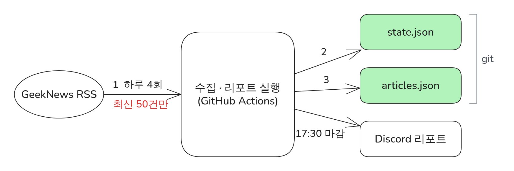

# P1. 리포트 수집에서 RSS 50건 제한으로 생기는 누락을 하루 4회 수집과 고정 마감으로 해결 (가제)

> 상태: 후보 · 관련 설계: SCH-R1~R7, ADR-001, ADR-004 · 관련 로그: [L-20260929-1](../logs/L-20260929-1.md), [L-20260930-1](../logs/L-20260930-1.md) · 그림: `FIG-P1-rss-coverage` · 증거: `evidence/P1/`

<!-- PDF:START -->

### 전체적인 아키텍처

### 문제 원인

- 설계 단계에서 GeekNews RSS를 직접 확인해 보니 피드에는 **최신 50건만** 들어 있었다 (2026-09-28 확인).
- 하루 한 번(17:30)만 수집하면, 그날 올라온 글이 50건을 넘는 날 오래된 글이 리포트에서 빠진다.
- 개별 글 페이지는 브라우저 확인 화면 때문에 프로그램으로 읽을 수 없어, RSS 말고는 수집 경로가 없었다.

### 해결 과정

- ① 수집과 리포트를 분리해 23·09·13·17:30 네 번 수집하고, 최대 수집 간격을 10시간으로 줄였다.
- ② 범위 경계를 자정이 아닌 "지난 마감 시각 초과 ~ 17:30 이하"로 고정해 실행이 늦거나 실패해도 다음 리포트가 빈틈없이 이어받게 했다.
- ③ 글 id로 중복을 제거하며 수집함에 누적한다.
- 테스트
  - 경계 사례 6개 단위 테스트 (`test_sch_r*`)
  - 7일간 운영 데이터로 누락 측정 (결과 참고)

### 결과

- 누락 글 수: 개선 전 **측정 예정** → 개선 후 **측정 예정**
- 테스트 조건: 측정 예정
- 근거: 측정 예정

<!-- PDF:END -->

---

## 작성 메모 (PDF에 넣지 않음)

### 측정 계획
| 지표 | 개선 전 | 개선 후 | 조건 |
|---|---|---|---|
| 하루 누락 글 수 | 모의: 매일 17:30 시점 RSS의 최신 50건에 들어 있지 않았을 그날 글 수를 수집 기록(`published`, 수집 시각)으로 계산 | 실제: 리포트에 들어간 글 id와 GeekNews topic id 연속 구간을 대조해 빠진 id 수 (삭제 글은 별도 표기) | 연속 7일, 운영 환경 |
| 하루 글 수 분포 | - | 7일간 날짜별 글 수 (50건 초과한 날 수) | 같은 기간 |

### 필요한 증거
- [ ] `data/metrics.jsonl`의 수집 실행별 `rss_items`, `new_items`, `oldest_published` (DATA-06)
- [ ] `experiments/p1_coverage.py` 결과 CSV
- [ ] 50건을 넘은 날이 실제로 있었는지 (없으면 "위험이 발생하지 않았다"도 결과로 기록하되, 항목 가치 재평가)

### 면접 예상 질문
- 수집 주기를 더 촘촘히(매시간) 하지 않은 이유? → GitHub Actions 사용량·커밋 수와 누락 위험의 균형
- GeekNews가 50건을 넘는 날이 실제로 얼마나 있었나?

### 변경 이력
| 날짜 | 누가 | 내용 |
|---|---|---|
| 2026-09-28 | 설계 대화 | 후보 등록 |
| 2026-09-29 | Claude Code | T01: 수집 지표(`rss_items`, `new_items`, `rss_oldest_published`, `rss_newest_published`) 기록 구현. 피드 저장본 1회 관찰을 로그·증거로 남김 (50건 = 22시간 33분치, `evidence/P1/2026-09-29-rss-snapshot.md`) |
| 2026-09-30 | Claude Code | T02: 경계 사례 6개 테스트(`tests/test_window.py`, `test_sch_r*`) 구현. 17:30 전·자정 넘어 시작한 실행의 마감 규칙 보완 (L-20260930-1) |
