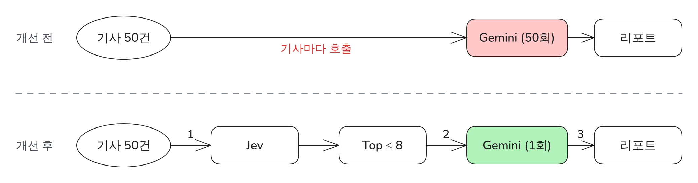

# P2. 리포트 요약에서 Gemini 무료 한도 초과 위험을 Jev 선별 후 1회 호출로 해결 (가제)

> 상태: 후보 · 관련 설계: ADR-002, JEV-R1~R9, GEM-A, GEM-F1 · 관련 로그: - · 그림: `FIG-P2-gemini-calls` · 증거: `evidence/P2/`

<!-- PDF:START -->

### 전체적인 아키텍처

### 문제 원인

- Gemini 무료 티어는 Flash 계열만 쓸 수 있고 분당 요청 수가 10회 안팎으로 제한된다 (설계 단계 조사).
- 하루 약 50건을 기사마다 요약하면 한 번의 실행에서 한도를 넘어 429 오류가 날 수 있다.
- 무엇을 요약할지 고르는 일까지 LLM에 맡기면 호출 수가 더 늘고, JSON 속 "확신도"는 보정된 확률이 아니다.

### 해결 과정

- ① 판단과 글쓰기를 분리했다: 분야·관심도·실무·제외 판단은 판단 전용 모델 Jev가, 요약은 Gemini가 맡는다.
- ② Jev는 선택지별 확률을 돌려주므로 기준선으로 Top 최대 8개만 고르고, Gemini는 그 8개와 총평을 **한 번의 호출**로 받는다.
- ③ Gemini가 실패해도 RSS 원문 요약으로 대체해 리포트는 항상 나가게 했다.
- 테스트
  - 429를 흉내 낸 가짜 응답으로 재시도·대체 테스트 (`test_gem_f1_*`)
  - 같은 50건으로 기사별 호출 방식과 비교 (결과 참고)

### 결과

- 실행당 Gemini 호출 수: 개선 전 **측정 예정** → 개선 후 **측정 예정**
- 429 발생 수 / 처리 시간 / 비용: **측정 예정**
- 테스트 조건: 측정 예정

<!-- PDF:END -->

---

## 작성 메모 (PDF에 넣지 않음)

### 측정 계획
| 지표 | 개선 전 | 개선 후 | 조건 |
|---|---|---|---|
| Gemini 호출 수 / 실행 | `experiments/p2_naive_gemini.py`: 같은 날 50건을 기사마다 요약 (1회만 실행) | 운영 `metrics.jsonl`의 `gemini_calls` | 같은 50건, 같은 모델, 무료 티어 |
| 429 발생 수 | 위 실험의 429 횟수 | `gemini_429` | 〃 |
| 전체 처리 시간 | 위 실험 소요 시간 | 리포트 실행의 요약 단계 시간 | 〃 |
| 판단 비용 | - | Jev `usage.cost` 합계 (7일) | OpenRouter |

### 필요한 증거
- [ ] 실험 1회 실행 로그와 결과 CSV (`evidence/P2/`)
- [ ] 7일간 `metrics.jsonl`
- [ ] 무료 티어 한도 스크린샷 또는 당시 문서 기록 (측정 날짜 기준)

### 면접 예상 질문
- Gemini 하나로 분류까지 하면 안 됐나? → 호출 수·확률 보정·기준선 재조정 가능성
- Jev가 틀리면? → 확률 원본 저장, 주간 보정 (P4)

### 변경 이력
| 날짜 | 누가 | 내용 |
|---|---|---|
| 2026-09-28 | 설계 대화 | 후보 등록 |
