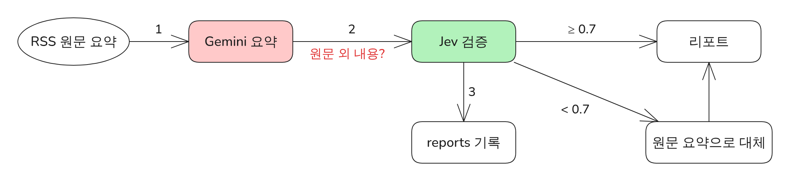

# P3. 리포트 요약에서 LLM이 원문에 없는 내용을 쓰는 문제를 Jev 근거 검증으로 차단 (가제)

> 상태: 후보 · 관련 설계: GEM-A1, JEV-V1~V3 · 관련 로그: - · 그림: `FIG-P3-summary-grounding` · 증거: `evidence/P3/`

<!-- PDF:START -->

### 전체적인 아키텍처

### 문제 원인

- GeekNews RSS 요약문은 중간에 잘려 있어, 요약 모델이 빈 부분을 추측으로 채울 위험이 크다 (설계 단계 확인).
- 프롬프트로 "원문에 없는 내용 금지"를 지시해도 지켜지는지 확인할 방법이 없었다.
- 원문 외 숫자·이름이 섞인 요약은 리포트 신뢰를 떨어뜨린다.

### 해결 과정

- ① 요약 프롬프트에 원문 외 내용 금지 규칙을 넣었다 (1차 방어).
- ② 요약마다 Jev에 "모든 내용이 원문에 근거하는가?"를 묻고, 확률이 기준(0.7) 미만이면 RSS 원문 요약으로 바꿨다 (2차 방어).
- ③ 검증 확률을 모두 저장해 기준선을 나중에 조정할 수 있게 했다.
- 테스트
  - 원문에 없는 숫자를 넣은 가짜 요약이 대체되는지 단위 테스트 (`test_jev_v2_*`)
  - 실제 요약을 내가 직접 라벨링해 비교 (결과 참고)

### 결과

- 원문 외 내용이 포함된 요약 비율: 검증 전 **측정 예정** → 검증 후 **측정 예정**
- Jev 검증의 정밀도/재현율 (내 라벨 기준): **측정 예정**
- 테스트 조건: 측정 예정

<!-- PDF:END -->

---

## 작성 메모 (PDF에 넣지 않음)

### 측정 계획
| 지표 | 방법 | 조건 |
|---|---|---|
| 원문 외 내용 비율 (검증 전) | Gemini가 쓴 요약 전부를 원문과 비교해 **내가** 포함/미포함 라벨링 | 운영 1~2주, 최소 40건 |
| 원문 외 내용 비율 (검증 후) | 최종 리포트에 나간 요약 기준으로 같은 라벨 사용 | 같은 표본 |
| 검증 정밀도/재현율 | Jev `verify` 값(기준 0.7)과 내 라벨 비교 | 같은 표본 |

### 필요한 증거
- [ ] `evidence/P3/labels.csv` (날짜, 번호, 원문, Gemini 요약, verify, 내 라벨, 메모) — 라벨 열은 내가 채운다
- [ ] 라벨링 기준 한 단락 (무엇을 "원문 외"로 봤는지)

### 면접 예상 질문
- LLM으로 LLM을 검증하면 되지 않나? → 비용·호출 수, 판단 전용 모델의 확률 출력
- 기준 0.7은 어떻게 정했나? → 라벨 데이터로 조정한 과정

### 변경 이력
| 날짜 | 누가 | 내용 |
|---|---|---|
| 2026-09-28 | 설계 대화 | 후보 등록 |
