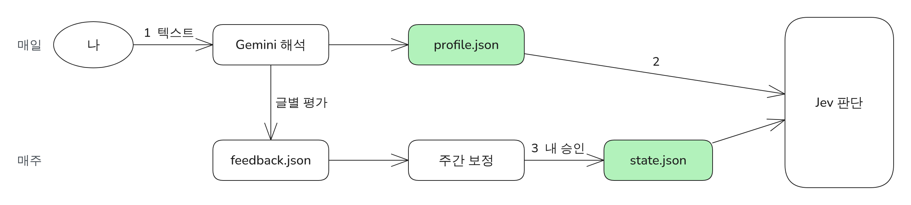

# P4. 개인화 리포트에서 취향이 반영되지 않는 문제를 텍스트 피드백과 기준선 보정으로 해결 (가제)

> 상태: 후보 · 관련 설계: FB-01~26, ADR-003, ADR-006 · 관련 로그: - · 그림: `FIG-P4-feedback-loop` · 증거: `evidence/P4/`

<!-- PDF:START -->

### 전체적인 아키텍처

### 문제 원인

- 처음 설계한 좋아요·별로 이모지 반응으로는 "무엇이" 좋고 싫은지 전달할 수 없었다 (설계 단계 판단).
- 판단 모델은 피드백으로 스스로 학습하지 않으므로, 피드백을 반영할 별도 구조가 필요했다.
- 취향 목록이 끝없이 늘어나면 판단 입력이 커지고 오래된 취향이 남는다.

### 해결 과정

- ① 피드백을 자유 텍스트로 받고 Gemini로 규칙(좋아요·싫어요·글별 평가)으로 바꿨다. 리포트의 모든 글에 번호를 붙여 "3번 별로"처럼 가리킬 수 있게 했다.
- ② 경로 1: 취향 프로필을 Jev 입력에 넣어 다음 날 판단에 바로 반영했다 (15개 제한, 60일 미언급 정리).
- ③ 경로 2: 매주 평가 기록과 Jev 점수를 비교해 기준선 변경을 제안하고, 내가 승인할 때만 바꿨다.
- 테스트
  - 피드백 예시 → 프로필 반영 단위 테스트 (`test_fb_*`)
  - 4주 운영으로 Top 적중률 비교 (결과 참고)

### 결과

- 주별 Top "좋음" 비율: 1주차 **측정 예정** → 4주차 **측정 예정**
- 기준선 변경 제안/승인 횟수: **측정 예정**
- 테스트 조건: 측정 예정

<!-- PDF:END -->

---

## 작성 메모 (PDF에 넣지 않음)

### 측정 계획
| 지표 | 방법 | 조건 |
|---|---|---|
| Top "좋음" 비율 | 주별 (Top 중 good 평가 수) / (Top 중 평가한 수) | 4주, 매일 Top에 최소 한 번 평가 |
| "Top에 있었어야 한 글" 수 | 확인·기타 섹션에 good 평가가 붙은 수 | 〃 |
| 제외 규칙 적중 | 싫어요 주제 글이 Top에 오른 횟수 | 〃 |

### 필요한 증거
- [ ] `data/feedback.json`, `data/reports/` 4주치
- [ ] `experiments/p4_weekly.py` 주별 집계 CSV
- [ ] 기준선 변경 이력 (reports의 `thresholds_used`)

### 주의
- 평가를 꾸준히 하지 않으면 측정이 성립하지 않는다. 이 항목은 **내가 매일 평가를 남기는 것**이 전제다.

### 변경 이력
| 날짜 | 누가 | 내용 |
|---|---|---|
| 2026-09-28 | 설계 대화 | 후보 등록 |
